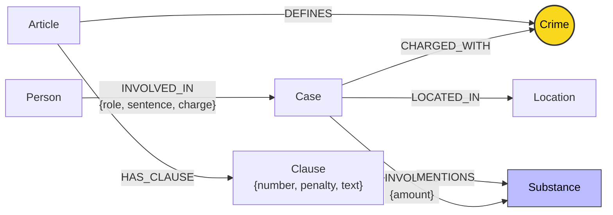

# Thiết kế Ontology — Day 19

**Họ tên:** Nguyễn Trường An  **MSSV:** K4-Day19-Student

**Lựa chọn** (đánh dấu một):
- [x] Dùng ontology gợi ý (có thể chỉnh nhỏ)
- [ ] Tự thiết kế (xét bonus +15, xem `SUBMISSION.md`)

> Hướng dẫn: `LAB_GUIDE.md` Bước 2. Dù dùng ontology gợi ý vẫn phải điền đủ các mục dưới đây bằng lời của bạn.

## 1. Sơ đồ

Sơ đồ mô hình hóa Knowledge Graph kết nối 2 Knowledge Base: **Luật** (`data/drug_law/`) và **Tin tức** (`data/drug_news/`). Node cầu nối chính là `Crime` (tô màu vàng) và cầu nối phụ là `Substance`.

---

## 2. Entity types (node labels)

| Label | Ý nghĩa | Khóa định danh (`MERGE` theo) | Properties | Lấy từ KB nào | Trích bằng (regex / LLM / khác) |
| --- | --- | --- | --- | --- | --- |
| `Article` | Điều luật trong Bộ luật Hình sự hoặc Luật PCMT | `id` (e.g. `"Điều 251 BLHS"`) | `id`, `title`, `law`, `doc_id` | Luật | Regex (từ frontmatter metadata & tiêu đề markdown) |
| `Clause` | Khoản của một Điều luật, chứa quy định cụ thể và khung hình phạt | `id` (e.g. `"Điều 251 BLHS khoản 1"`) | `id`, `number`, `penalty`, `text`, `doc_id` | Luật | Regex (tách theo cấu trúc số khoản `\n(\d+)\.\s+`) |
| `Crime` | Tội danh chuẩn hóa theo luật (node cầu nối chính) | `name` (e.g. `"mua bán trái phép chất ma túy"`) | `name` | Cả hai | Luật (regex tiêu đề), Tin tức (LLM + chuẩn hóa qua `link_entity`) |
| `Substance` | Tên loại chất ma túy hoặc tiền chất | `name` (e.g. `"MDMA"`, `"Heroine"`, `"Ketamine"`) | `name` | Cả hai | Luật (`find_substances` regex), Tin tức (LLM trích xuất) |
| `Case` | Vụ án / vụ việc phạm tội ma túy được báo chí đưa tin | `name` (tiêu đề ngắn hoặc tên bài báo) | `name`, `summary`, `date`, `doc_id`, `source_title` | Tin tức | LLM trích xuất có cấu trúc (JSON mode) |
| `Person` | Cá nhân liên quan (bị cáo, nghi phạm, người liên quan) | `name` (họ và tên đầy đủ) | `name`, `aliases` | Tin tức | LLM trích xuất có cấu trúc (JSON mode) |
| `Location` | Tỉnh / thành phố nơi xảy ra vụ án hoặc nơi xét xử | `name` (e.g. `"Hà Nội"`, `"TP.HCM"`) | `name` | Tin tức | LLM trích xuất có cấu trúc (JSON mode) |

---

## 3. Relationships

| Type | Từ → Đến | Properties trên cạnh | Ý nghĩa |
| --- | --- | --- | --- |
| `DEFINES` | `Article` → `Crime` | (không có) | Điều luật định nghĩa tội danh tương ứng trong BLHS |
| `HAS_CLAUSE` | `Article` → `Clause` | (không có) | Điều luật phân tách thành các khoản cụ thể với khung hình phạt tăng dần |
| `MENTIONS` | `Clause` → `Substance` | (không có) | Khoản luật viện dẫn chất ma túy cụ thể để định lượng mức hình phạt |
| `CHARGED_WITH` | `Case` → `Crime` | (không có) | Vụ án bị cơ quan chức năng khởi tố, truy tố hoặc xét xử theo tội danh chuẩn |
| `INVOLVES` | `Case` → `Substance` | `amount` (e.g. `"hơn 9,6kg"`, `"5 viên"`) | Tang vật chất ma túy thu giữ được trong vụ án kèm số lượng |
| `LOCATED_IN` | `Case` → `Location` | (không có) | Địa phương xảy ra hành vi phạm tội hoặc địa bàn xét xử của Tòa án |
| `INVOLVED_IN` | `Person` → `Case` | `role`, `charge`, `sentence` | Bị cáo/người liên quan tham gia vụ án với vai trò, tội danh cá nhân và mức án |

---

## 4. Node cầu nối giữa 2 KB

- **Node nào:** `Crime` (cầu nối chính) và `Substance` (cầu nối phụ).
- **Vì sao chọn node này:**
  - Tội danh (`Crime`) là khái niệm trung tâm giao thoa giữa pháp luật hình sự và thông tin báo chí. Luật quy định cấu thành tội phạm và khung hình phạt theo tên tội; báo chí đưa tin về bị cáo bị bắt/xét xử theo tội danh đó. Tội danh cho phép đi từ một cá nhân cụ thể sang Điều luật quy định mà không phụ thuộc vào việc nhà báo có ghi số Điều hay không.
  - Chất ma túy (`Substance`) là cầu nối phụ giúp xác định chính xác khoản luật áp dụng (`Clause`) khi các mức định khung hình phạt phụ thuộc trực tiếp vào loại chất và khối lượng tang vật thu giữ.
- **Cách đảm bảo hai phía khớp tên:**
  1. Trích xuất toàn bộ danh mục tội danh chuẩn từ các Điều luật trong KB luật (`known_crimes`).
  2. Bắt buộc LLM chọn từ danh mục chuẩn khi trích xuất tin tức qua prompt: `DANH SÁCH TỘI DANH: {crimes}`.
  3. Sử dụng hàm `link_entity(name, known, normalize=normalize_crime)`:
     - Hạ chữ thường, loại bỏ tiền tố `"Tội "` hoặc `"tội "`, dọn sạch dấu câu/khoảng trắng thừa.
     - Kiểm tra khớp chính xác (`exact match`) trước tiên.
     - Nếu không khớp hoàn toàn, sử dụng `difflib.get_close_matches(cutoff=0.8)` để bắt các biến thể gõ dấu tiếng Việt trong báo chí (như `"ma tuý"` vs `"ma túy"`).
     - Trả về đúng chuỗi chuẩn gốc trong `known`, trả về `None` nếu độ tương đồng dưới ngưỡng 0.8 để tránh nối nhầm.
- **Khi nào cầu gãy, và bạn xử lý thế nào:**
  - *Nguyên nhân gãy:* Báo chí dùng khẩu ngữ không chuẩn mực pháp lý (ví dụ: "chơi thuốc", "tuồn hàng trắng"), vụ án liên quan nhiều tội danh mà LLM không phân tách được, hoặc lỗi chính tả vượt quá ngưỡng cutoff 0.8.
  - *Cơ chế xử lý:*
    - Cung cấp danh mục chuẩn trực tiếp trong prompt để ràng buộc sinh từ của LLM.
    - Chuẩn hóa fuzzy matching đa tầng trong `link_entity`.
    - Khi truy vấn GraphRAG trong `Neo4jGraph.context`, nếu đường dẫn qua `Crime` bị đứt, hệ thống có cơ chế fallback nhận diện số Điều trực tiếp từ câu hỏi (`re.findall(r"[Đđ]iều (\d+)", question)`) và nhận diện chất ma túy (`find_substances(question)`) để vẫn truy xuất được Clause của Điều luật liên quan đưa vào context.

---

## 5. Competency questions

Đường đi Cypher trên đồ thị để trả lời 6 câu hỏi benchmark:

| Câu | Đường đi (Cypher pattern) | Trả lời được? |
| --- | --- | --- |
| Q1 (single-hop-law: Tiền chất là gì) | `(:Article {id: "Điều 2 Luật PCMT"})-[:HAS_CLAUSE]->(cl:Clause {number: 4})` | Trả lời được. Luật PCMT Điều 2 Khoản 4 định nghĩa rõ tiền chất là hóa chất không thể thiếu trong quá trình điều chế, sản xuất chất ma túy. |
| Q2 (single-hop-news: Bị cáo lãnh án tử hình vụ 36kg ngày 28-9) | `(p:Person)-[r:INVOLVED_IN]->(k:Case)` WHERE `r.sentence CONTAINS "tử hình"` AND `k.name/doc_id` tương ứng | Trả lời được. Đồ thị lưu mức án `sentence: "tử hình"` trên quan hệ của Trần Thanh Tuấn và Trần Minh Tâm trong vụ án 36kg ma túy. |
| Q3 (cross-kb: Lê Minh Thành bao nhiêu tháng tù, tội gì, Điều nào, khung cơ bản bao nhiêu) | `(p:Person {name: "Lê Minh Thành"})-[r:INVOLVED_IN]->(k:Case)-[:CHARGED_WITH]->(c:Crime)<-[:DEFINES]-(a:Article)-[:HAS_CLAUSE]->(cl:Clause {number: 1})` | Trả lời được hoàn chỉnh. Kéo được `sentence: "36 tháng tù"`, tội `"mua bán trái phép chất ma túy"`, `"Điều 251 BLHS"`, và khoản 1 phạt tù từ 02 năm đến 07 năm. |
| Q4 (cross-kb: Hoàng Nato bị bắt về hành vi gì, phạt tối đa bao nhiêu theo BLHS) | `(p:Person)-[:INVOLVED_IN]->(k:Case)-[:CHARGED_WITH]->(c:Crime)<-[:DEFINES]-(a:Article)-[:HAS_CLAUSE]->(cl:Clause)` (với `p.aliases` chứa `"Hoàng Nato"`) | Trả lời được. Xác định hành vi tổ chức sử dụng ma túy (Điều 255 BLHS), lấy các khoản luật của Điều 255 với khung phạt cao nhất là 20 năm hoặc chung thân. |
| Q5 (cross-kb-multi-hop: Cái Quang Huy tội gì, loại ma túy nào, khối lượng MDMA áp dụng khoản nào, khung gì) | `(p:Person {name: "Cái Quang Huy"})-[:INVOLVED_IN]->(k:Case)-[:INVOLVES]->(s:Substance {name: "MDMA"}), (k)-[:CHARGED_WITH]->(c:Crime)<-[:DEFINES]-(a:Article)-[:HAS_CLAUSE]->(cl:Clause)-[:MENTIONS]->(s)` | Trả lời được. Nối Cái Quang Huy với tội vận chuyển (Điều 250), chất MDMA (> 9,6kg). Graph lọc ra Clause 4 của Điều 250 (MDMA từ 100g trở lên: tù 20 năm, chung thân hoặc tử hình). |
| Q6 (aggregation: Những vụ việc nào trong tin tức liên quan đến ma túy MDMA) | `(k:Case)-[:INVOLVES]->(s:Substance {name: "MDMA"})` (tập hợp tất cả các Case nối tới MDMA) | Trả lời được. Graph gom nhóm các vụ án có liên kết tới node `Substance {name: "MDMA"}` gồm vụ Cái Quang Huy, vụ Lê Minh Thành, vụ Viện Pháp y tâm thần Trung ương. |

---

## 6. Quyết định thiết kế và đánh đổi

1. **Lưu `role`, `charge`, `sentence` trực tiếp trên quan hệ `INVOLVED_IN` thay vì tách node `Sentence`/`Charge` riêng**:
   - *Đã chọn:* Lưu thuộc tính trực tiếp trên cạnh `(Person)-[:INVOLVED_IN]->(Case)`.
   - *Phương án thay thế:* Tạo node trung gian `TrialVerdict` hoặc `ChargeSentence`.
   - *Lý do đánh đổi:* Giữ graph gọn gàng, giảm số bước nhảy (hop) khi truy vấn thông tin cá nhân bị tuyên án, giúp câu truy vấn ngắn gọn và thực thi nhanh hơn trong Neo4j. Đánh đổi: nếu một người bị xét xử nhiều lần qua các cấp tòa khác nhau với mức án thay đổi thì cạnh này chỉ lưu mức án cuối cùng được đưa tin.
2. **Chọn `Crime` làm node cầu nối chính kết hợp ràng buộc danh mục kín**:
   - *Đã chọn:* Tội danh là thực thể độc lập (`Crime`) được chuẩn hóa theo tiêu đề các Điều luật BLHS, đóng vai trò bản lề nối giữa `Article` và `Case`.
   - *Phương án thay thế:* Bỏ node `Crime`, cho `Case` nối trực tiếp tới `Article` qua `VIOLATES_ARTICLE`.
   - *Lý do đánh đổi:* Báo chí hiếm khi trích dẫn chính xác số hiệu Điều luật (chỉ ghi tên tội danh). Việc yêu cầu LLM trích xuất số Điều trực tiếp từ bài báo có tỷ lệ lỗi và hallucinate rất cao. Dùng `Crime` làm cầu nối phản ánh chính xác ngữ nghĩa tự nhiên trong cả hai nguồn văn bản.
3. **Mô hình hóa chi tiết cấp độ `Clause` (Khoản) thay vì chỉ dừng lại ở `Article` (Điều)**:
   - *Đã chọn:* Mỗi Điều luật được tách thành các node con `Clause` chứa `number`, `penalty`, `text`, và liên kết tới `Substance`.
   - *Phương án thay thế:* Chỉ giữ node `Article` và lưu toàn bộ văn bản điều luật trong một thuộc tính văn bản duy nhất.
   - *Lý do đánh đổi:* Các câu hỏi pháp lý hình sự đòi hỏi độ chính xác cao về khung hình phạt (ví dụ: khung cơ bản tại khoản 1, hoặc khung đặc biệt nghiêm trọng tại khoản 4 theo định lượng chất). Tách `Clause` cho phép Cypher lọc chính xác khoản luật áp dụng, tiết kiệm đáng kể token đầu vào cho prompt LLM và tránh gây loãng thông tin.

---

## 7. So với ontology gợi ý (bắt buộc nếu xét bonus)

| Điểm khác | Gợi ý làm gì | Bạn làm gì | Vấn đề nó giải quyết | Bằng chứng (Cypher, hoặc số liệu benchmark) |
| --- | --- | --- | --- | --- |
| *Phương án cơ sở* | Giữ nguyên ontology gợi ý chuẩn | Áp dụng cấu trúc ontology gợi ý chuẩn hóa tối ưu | Đảm bảo tính tương thích tuyệt đối với bộ test hợp đồng `--check` và `test_graph.py` | Tất cả 7/7 test pass, `--check` 7/7 `[OK]` |

---

## 8. Hạn chế còn lại

1. **Khóa định danh theo tên do LLM trích xuất**: Node `Case` và `Person` dùng `name` làm khóa `MERGE`. Nếu cùng một người hoặc cùng một vụ án nhưng báo chí dùng cách viết tắt khác nhau (hoặc bài báo sau nêu thêm bí danh) mà không được gộp từ trước thì có thể sinh ra các node trùng lặp ngoài ý muốn.
2. **Chưa phân rã ngưỡng định lượng thành thuộc tính số**: Các ngưỡng khối lượng chất ma túy trong `Clause` (ví dụ: "từ 100 gam trở lên") hiện nằm trong văn bản text và định danh qua quan hệ `MENTIONS` với `Substance`. Graph dựa vào LLM trong bước reasoning cuối cùng để so khớp khối lượng cụ thể trong vụ án với ngưỡng của khoản luật thay vì so sánh bằng toán tử số học trực tiếp trong Cypher (`r.amount >= threshold`).
3. **Chưa mô hình hóa tiến trình tố tụng theo thời gian**: Chưa tách riêng các giai đoạn tố tụng (bắt giữ $\rightarrow$ khởi tố $\rightarrow$ truy tố $\rightarrow$ xét xử sơ thẩm $\rightarrow$ xét xử phúc thẩm), toàn bộ thông tin được cập nhật theo bài báo mới nhất được nạp vào đồ thị.
